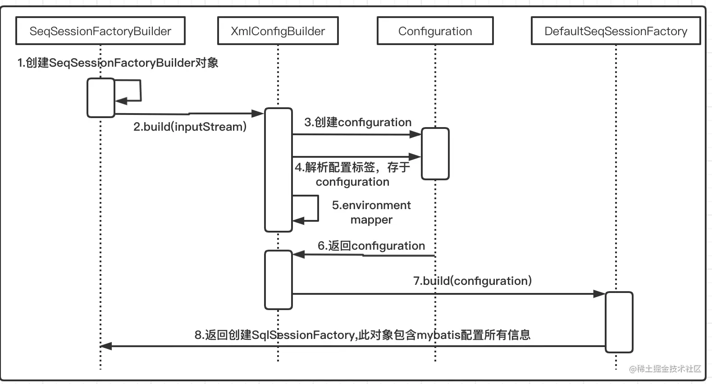
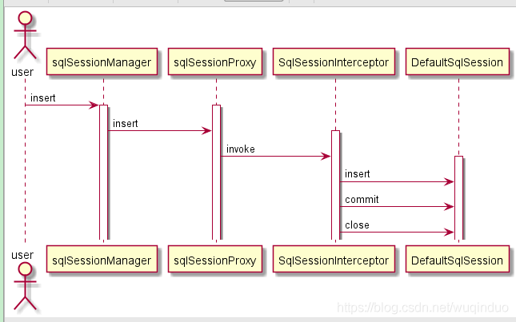
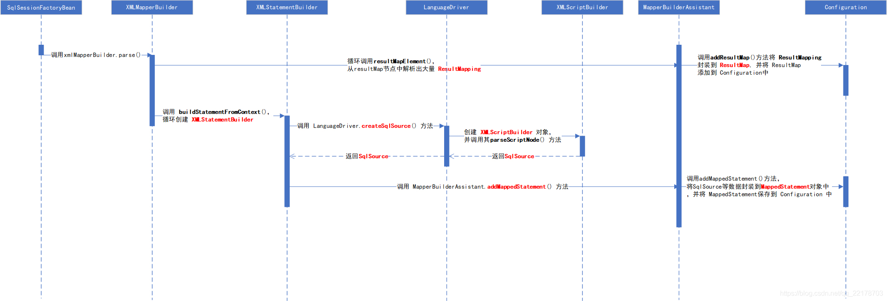
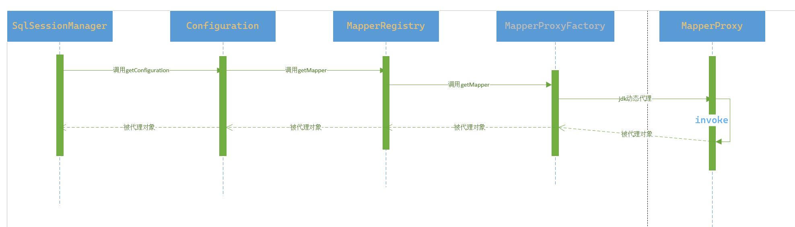

# Mybatis

## 源码解析

‍

| 包路径                            | 备注                 |
| --------------------------------- | -------------------- |
| ​`org.apache.ibatis.logging`​     | ​`日志`​             |
| ​`org.apache.ibatis.exceptions`​  | ​`异常`​             |
| ​`org.apache.ibatis.cache`​       | ​`缓存`​             |
| ​`org.apache.ibatis.parsing`​     | ​`解析`​             |
| ​`org.apache.ibatis.type`​        | ​`类型处理器`​       |
| ​`org.apache.ibatis.io`​          | ​`IO`​               |
| ​`org.apache.ibatis.reflection`​  | ​`反射`​             |
| ​`org.apache.ibatis.datasource`​  | ​`数据源`​           |
| ​`org.apache.ibatis.transaction`​ | ​`事务`​             |
| ​`org.apache.ibatis.session`​     | ​`会话`​             |
| ​`org.apache.ibatis.jdbc`​        | ​`jdbc单元测试工具`​ |
| ​`org.apache.ibatis.builder`​     | ​`构建`​             |
| ​`org.apache.ibatis.mapping`​     | ​`映射`​             |
| ​`org.apache.ibatis.scripting`​   | ​`脚本`​             |
| ​`org.apache.ibatis.annotations`​ | ​`注解`​             |
| ​`org.apache.ibatis.binding`​     | ​`绑定`​             |
| ​`org.apache.ibatis.executor`​    | ​`执行器`​           |
| ​`org.apache.ibatis.plugin`​      | ​`插件`​             |

### 配置初始化流程



## DefaultSqlSession，SqlSessionManager 与SqlSessionTemplate

### DefaultSqlSession

DefaultSqlSession 是SqlSession的默认实现。单独使用Mybatis时，我们通常使用DefaultSqlSession 来执行SQL，操作数据库。

缺点：

* 我们需要自己手动关闭sqlsesion，我们知道，人总是不可靠的。忘关sqlsession 是有很大概率发生的

* 线程安全问题：DefaultSqlSession是线程不安全的Sqlsession 。也就是说DefaultSqlSession不能是单例，

### SqlSessionManager

1. 动态代理，由代理对象解决 sqlSession关闭问题

    
2. ThreadLocal保存sqlSession，解决线程安全问题

```java
 
  private final ThreadLocal<SqlSession> localSqlSession = new ThreadLocal<>();

  sqlSessionManager.startManagedSession();//绑定Session到线程本地变量

  public void startManagedSession() {
    this.localSqlSession.set(openSession());
  }

```

‍

### SqlSessionTemplate

* 是Mybatis与Spring 整合时使用的线程安全sqlsession

SqlSessionTemplate 把获取sqlsession的工作交给了SqlSessionUtils去做了。

```java
/**
   * 动态代理增强
   * Proxy needed to route MyBatis method calls to the proper SqlSession got from Spring's Transaction Manager It also
   * unwraps exceptions thrown by {@code Method#invoke(Object, Object...)} to pass a {@code PersistenceException} to the
   * {@code PersistenceExceptionTranslator}.
   */
  private class SqlSessionInterceptor implements InvocationHandler {
    @Override
    public Object invoke(Object proxy, Method method, Object[] args) throws Throwable {
      SqlSession sqlSession = getSqlSession(SqlSessionTemplate.this.sqlSessionFactory,
          SqlSessionTemplate.this.executorType, SqlSessionTemplate.this.exceptionTranslator);
      try {
        Object result = method.invoke(sqlSession, args);
        if (!SqlSessionUtils.isSqlSessionTransactional(sqlSession, SqlSessionTemplate.this.sqlSessionFactory)) {
          // force commit even on non-dirty sessions because some databases require
          // a commit/rollback before calling close()
          sqlSession.commit(true);
        }
        return result;
      } catch (Throwable t) {
        Throwable unwrapped = unwrapThrowable(t);
        if (SqlSessionTemplate.this.exceptionTranslator != null && unwrapped instanceof PersistenceException) {
          // release the connection to avoid a deadlock if the translator is no loaded. See issue #22
          SqlSessionUtils.closeSqlSession(sqlSession, SqlSessionTemplate.this.sqlSessionFactory);
          sqlSession = null;
          Throwable translated = SqlSessionTemplate.this.exceptionTranslator
              .translateExceptionIfPossible((PersistenceException) unwrapped);
          if (translated != null) {
            unwrapped = translated;
          }
        }
        throw unwrapped;
      } finally {
        if (sqlSession != null) {
          SqlSessionUtils.closeSqlSession(sqlSession, SqlSessionTemplate.this.sqlSessionFactory);
        }
      }
    }
  }
```

```java
 public static SqlSession getSqlSession(SqlSessionFactory sessionFactory, ExecutorType executorType, PersistenceExceptionTranslator exceptionTranslator) {
    //从事务同步器中获取Sqlsession。
    SqlSessionHolder holder = (SqlSessionHolder) TransactionSynchronizationManager.getResource(sessionFactory);

    SqlSession session = sessionHolder(executorType, holder);
    if (session != null) {
      return session;
    }

    if (LOGGER.isDebugEnabled()) {
      LOGGER.debug("Creating a new SqlSession");
    }

    session = sessionFactory.openSession(executorType);

    registerSessionHolder(sessionFactory, executorType, exceptionTranslator, session);

    return session;
  }
```

SqlSessionUtils 会先尝试从`TransactionSynchronizationManager`​事务同步器中获取sqlsesion，获取不到再从工厂内获取。

```java
  public static SqlSession getSqlSession(SqlSessionFactory sessionFactory, ExecutorType executorType,
      PersistenceExceptionTranslator exceptionTranslator) {

    notNull(sessionFactory, NO_SQL_SESSION_FACTORY_SPECIFIED);
    notNull(executorType, NO_EXECUTOR_TYPE_SPECIFIED);

    SqlSessionHolder holder = (SqlSessionHolder) TransactionSynchronizationManager.getResource(sessionFactory);

    SqlSession session = sessionHolder(executorType, holder);
    if (session != null) {
      return session;
    }

    LOGGER.debug(() -> "Creating a new SqlSession");
    session = sessionFactory.openSession(executorType);

    registerSessionHolder(sessionFactory, executorType, exceptionTranslator, session);

    return session;
  }

```

​((20230426133814-35k2ji0 "TransactionSynchronizationManager"))​​是spring事务实现原理的重要组件。

* 动态代理，由代理对象解决 sqlSession关闭问题

  * session 如果是由TransactionSynchronizationManager管理的，则只会更新引用计数器，让**Spring在托管事务结束**时调用close回调，关闭session。
  * session不是由TransactionSynchronizationManager 管理的，则直接关闭session

    ```java
    public static void closeSqlSession(SqlSession session, SqlSessionFactory sessionFactory) {

        SqlSessionHolder holder = (SqlSessionHolder) TransactionSynchronizationManager.getResource(sessionFactory);
        if ((holder != null) && (holder.getSqlSession() == session)) {
         //计数减1
          holder.released();
        } else {
        //关闭session
          session.close();
        }
      }
    ```

* TransactionSynchronizationManager使用ThreadLocal保存sqlSession，解决线程安全问题

## 解析映射器 ​

### ​`XMLConfigBuilder`​

主要用于解析mybatis-config.xml 配置文件的信息

### ​`XMLMapperBuilder`​

sql的解析，主要用于XXXMapper.xml的解析

mapper.xml  解析流程



## Mybatis 动态代理



### ​`MapperProxyFactory`​​

```java
public class MapperProxyFactory<T> {

  private final Class<T> mapperInterface;
  // MapperMethodInvoker jdk动态代理的实现
  private final Map<Method, MapperMethodInvoker> methodCache = new ConcurrentHashMap<>();

  public MapperProxyFactory(Class<T> mapperInterface) {
    this.mapperInterface = mapperInterface;
  }

  public Class<T> getMapperInterface() {
    return mapperInterface;
  }

  public Map<Method, MapperMethodInvoker> getMethodCache() {
    return methodCache;
  }

  @SuppressWarnings("unchecked")
  protected T newInstance(MapperProxy<T> mapperProxy) {
    //jdk 接口动态代理
    return (T) Proxy.newProxyInstance(mapperInterface.getClassLoader(), new Class[] { mapperInterface }, mapperProxy);
  }

  public T newInstance(SqlSession sqlSession) {
    final MapperProxy<T> mapperProxy = new MapperProxy<>(sqlSession, mapperInterface, methodCache);
    return newInstance(mapperProxy);
  }

}

```

### MapperMethodInvoker

```java
// jdk动态代理 具体实现逻辑 
public class MapperProxy<T> implements InvocationHandler, Serializable {

  private static final long serialVersionUID = -4724728412955527868L;
  //接口访问权限
  private static final int ALLOWED_MODES = MethodHandles.Lookup.PRIVATE | MethodHandles.Lookup.PROTECTED
      | MethodHandles.Lookup.PACKAGE | MethodHandles.Lookup.PUBLIC;
  private static final Constructor<Lookup> lookupConstructor;
  private static final Method privateLookupInMethod;
  private final SqlSession sqlSession;
  private final Class<T> mapperInterface;
  private final Map<Method, MapperMethodInvoker> methodCache;

  public MapperProxy(SqlSession sqlSession, Class<T> mapperInterface, Map<Method, MapperMethodInvoker> methodCache) {
    this.sqlSession = sqlSession;
    this.mapperInterface = mapperInterface;
    this.methodCache = methodCache;
  }

  static {
    Method privateLookupIn;
    try {
      privateLookupIn = MethodHandles.class.getMethod("privateLookupIn", Class.class, MethodHandles.Lookup.class);
    } catch (NoSuchMethodException e) {
      privateLookupIn = null;
    }
    privateLookupInMethod = privateLookupIn;

    Constructor<Lookup> lookup = null;
    if (privateLookupInMethod == null) {
      // JDK 1.8
      try {
        lookup = MethodHandles.Lookup.class.getDeclaredConstructor(Class.class, int.class);
        lookup.setAccessible(true);
      } catch (NoSuchMethodException e) {
        throw new IllegalStateException(
            "There is neither 'privateLookupIn(Class, Lookup)' nor 'Lookup(Class, int)' method in java.lang.invoke.MethodHandles.",
            e);
      } catch (Exception e) {
        lookup = null;
      }
    }
    lookupConstructor = lookup;
  }

  @Override
  public Object invoke(Object proxy, Method method, Object[] args) throws Throwable {
    try {
      if (Object.class.equals(method.getDeclaringClass())) {
        return method.invoke(this, args);
      }
      return cachedInvoker(method).invoke(proxy, method, args, sqlSession);
    } catch (Throwable t) {
      throw ExceptionUtil.unwrapThrowable(t);
    }
  }

  private MapperMethodInvoker cachedInvoker(Method method) throws Throwable {
    try {
      return MapUtil.computeIfAbsent(methodCache, method, m -> {
        if (!m.isDefault()) {
          return new PlainMethodInvoker(new MapperMethod(mapperInterface, method, sqlSession.getConfiguration()));
        }
        try {
          if (privateLookupInMethod == null) {
            return new DefaultMethodInvoker(getMethodHandleJava8(method));
          } else {
            return new DefaultMethodInvoker(getMethodHandleJava9(method));
          }
        } catch (IllegalAccessException | InstantiationException | InvocationTargetException
            | NoSuchMethodException e) {
          throw new RuntimeException(e);
        }
      });
    } catch (RuntimeException re) {
      Throwable cause = re.getCause();
      throw cause == null ? re : cause;
    }
  }

  private MethodHandle getMethodHandleJava9(Method method)
      throws NoSuchMethodException, IllegalAccessException, InvocationTargetException {
    final Class<?> declaringClass = method.getDeclaringClass();
    return ((Lookup) privateLookupInMethod.invoke(null, declaringClass, MethodHandles.lookup())).findSpecial(
        declaringClass, method.getName(), MethodType.methodType(method.getReturnType(), method.getParameterTypes()),
        declaringClass);
  }

  private MethodHandle getMethodHandleJava8(Method method)
      throws IllegalAccessException, InstantiationException, InvocationTargetException {
    final Class<?> declaringClass = method.getDeclaringClass();
    return lookupConstructor.newInstance(declaringClass, ALLOWED_MODES).unreflectSpecial(method, declaringClass);
  }

  interface MapperMethodInvoker {
    Object invoke(Object proxy, Method method, Object[] args, SqlSession sqlSession) throws Throwable;
  }
  // mybatis 非默认方法的执行
  private static class PlainMethodInvoker implements MapperMethodInvoker {
    private final MapperMethod mapperMethod;

    public PlainMethodInvoker(MapperMethod mapperMethod) {
      this.mapperMethod = mapperMethod;
    }

    @Override
    public Object invoke(Object proxy, Method method, Object[] args, SqlSession sqlSession) throws Throwable {
      return mapperMethod.execute(sqlSession, args);
    }
  }
  // 默认方法的执行
  private static class DefaultMethodInvoker implements MapperMethodInvoker {
    private final MethodHandle methodHandle;

    public DefaultMethodInvoker(MethodHandle methodHandle) {
      this.methodHandle = methodHandle;
    }

    @Override
    public Object invoke(Object proxy, Method method, Object[] args, SqlSession sqlSession) throws Throwable {
      return methodHandle.bindTo(proxy).invokeWithArguments(args);
    }
  }
}
```

### ​`MapperMethod`​

```java
//mybatis 实现的方法
public class MapperMethod {

  private final SqlCommand command;
  private final MethodSignature method;

  public MapperMethod(Class<?> mapperInterface, Method method, Configuration config) {
    this.command = new SqlCommand(config, mapperInterface, method);
    this.method = new MethodSignature(config, mapperInterface, method);
  }

  public Object execute(SqlSession sqlSession, Object[] args) {
    Object result;
    switch (command.getType()) {
      case INSERT: {
        Object param = method.convertArgsToSqlCommandParam(args);
        result = rowCountResult(sqlSession.insert(command.getName(), param));
        break;
      }
      case UPDATE: {
        Object param = method.convertArgsToSqlCommandParam(args);
        result = rowCountResult(sqlSession.update(command.getName(), param));
        break;
      }
      case DELETE: {
        Object param = method.convertArgsToSqlCommandParam(args);
        result = rowCountResult(sqlSession.delete(command.getName(), param));
        break;
      }
      case SELECT:
        if (method.returnsVoid() && method.hasResultHandler()) {
          executeWithResultHandler(sqlSession, args);
          result = null;
        } else if (method.returnsMany()) {
          result = executeForMany(sqlSession, args);
        } else if (method.returnsMap()) {
          result = executeForMap(sqlSession, args);
        } else if (method.returnsCursor()) {
          result = executeForCursor(sqlSession, args);
        } else {
          Object param = method.convertArgsToSqlCommandParam(args);
          result = sqlSession.selectOne(command.getName(), param);
          if (method.returnsOptional() && (result == null || !method.getReturnType().equals(result.getClass()))) {
            result = Optional.ofNullable(result);
          }
        }
        break;
      case FLUSH:
        result = sqlSession.flushStatements();
        break;
      default:
        throw new BindingException("Unknown execution method for: " + command.getName());
    }
    if (result == null && method.getReturnType().isPrimitive() && !method.returnsVoid()) {
      throw new BindingException("Mapper method '" + command.getName()
          + "' attempted to return null from a method with a primitive return type (" + method.getReturnType() + ").");
    }
    return result;
  }

  private Object rowCountResult(int rowCount) {
    final Object result;
    if (method.returnsVoid()) {
      result = null;
    } else if (Integer.class.equals(method.getReturnType()) || Integer.TYPE.equals(method.getReturnType())) {
      result = rowCount;
    } else if (Long.class.equals(method.getReturnType()) || Long.TYPE.equals(method.getReturnType())) {
      result = (long) rowCount;
    } else if (Boolean.class.equals(method.getReturnType()) || Boolean.TYPE.equals(method.getReturnType())) {
      result = rowCount > 0;
    } else {
      throw new BindingException(
          "Mapper method '" + command.getName() + "' has an unsupported return type: " + method.getReturnType());
    }
    return result;
  }

  private void executeWithResultHandler(SqlSession sqlSession, Object[] args) {
    MappedStatement ms = sqlSession.getConfiguration().getMappedStatement(command.getName());
    if (!StatementType.CALLABLE.equals(ms.getStatementType())
        && void.class.equals(ms.getResultMaps().get(0).getType())) {
      throw new BindingException(
          "method " + command.getName() + " needs either a @ResultMap annotation, a @ResultType annotation,"
              + " or a resultType attribute in XML so a ResultHandler can be used as a parameter.");
    }
    Object param = method.convertArgsToSqlCommandParam(args);
    if (method.hasRowBounds()) {
      RowBounds rowBounds = method.extractRowBounds(args);
      sqlSession.select(command.getName(), param, rowBounds, method.extractResultHandler(args));
    } else {
      sqlSession.select(command.getName(), param, method.extractResultHandler(args));
    }
  }

  private <E> Object executeForMany(SqlSession sqlSession, Object[] args) {
    List<E> result;
    Object param = method.convertArgsToSqlCommandParam(args);
    if (method.hasRowBounds()) {
      RowBounds rowBounds = method.extractRowBounds(args);
      result = sqlSession.selectList(command.getName(), param, rowBounds);
    } else {
      result = sqlSession.selectList(command.getName(), param);
    }
    // issue #510 Collections & arrays support
    if (!method.getReturnType().isAssignableFrom(result.getClass())) {
      if (method.getReturnType().isArray()) {
        return convertToArray(result);
      }
      return convertToDeclaredCollection(sqlSession.getConfiguration(), result);
    }
    return result;
  }

  private <T> Cursor<T> executeForCursor(SqlSession sqlSession, Object[] args) {
    Cursor<T> result;
    Object param = method.convertArgsToSqlCommandParam(args);
    if (method.hasRowBounds()) {
      RowBounds rowBounds = method.extractRowBounds(args);
      result = sqlSession.selectCursor(command.getName(), param, rowBounds);
    } else {
      result = sqlSession.selectCursor(command.getName(), param);
    }
    return result;
  }

  private <E> Object convertToDeclaredCollection(Configuration config, List<E> list) {
    Object collection = config.getObjectFactory().create(method.getReturnType());
    MetaObject metaObject = config.newMetaObject(collection);
    metaObject.addAll(list);
    return collection;
  }

  @SuppressWarnings("unchecked")
  private <E> Object convertToArray(List<E> list) {
    Class<?> arrayComponentType = method.getReturnType().getComponentType();
    Object array = Array.newInstance(arrayComponentType, list.size());
    if (!arrayComponentType.isPrimitive()) {
      return list.toArray((E[]) array);
    }
    for (int i = 0; i < list.size(); i++) {
      Array.set(array, i, list.get(i));
    }
    return array;
  }

  private <K, V> Map<K, V> executeForMap(SqlSession sqlSession, Object[] args) {
    Map<K, V> result;
    Object param = method.convertArgsToSqlCommandParam(args);
    if (method.hasRowBounds()) {
      RowBounds rowBounds = method.extractRowBounds(args);
      result = sqlSession.selectMap(command.getName(), param, method.getMapKey(), rowBounds);
    } else {
      result = sqlSession.selectMap(command.getName(), param, method.getMapKey());
    }
    return result;
  }

  public static class ParamMap<V> extends HashMap<String, V> {

    private static final long serialVersionUID = -2212268410512043556L;

    @Override
    public V get(Object key) {
      if (!super.containsKey(key)) {
        throw new BindingException("Parameter '" + key + "' not found. Available parameters are " + keySet());
      }
      return super.get(key);
    }

  }

  public static class SqlCommand {

    private final String name;
    private final SqlCommandType type;

    public SqlCommand(Configuration configuration, Class<?> mapperInterface, Method method) {
      final String methodName = method.getName();
      final Class<?> declaringClass = method.getDeclaringClass();
      MappedStatement ms = resolveMappedStatement(mapperInterface, methodName, declaringClass, configuration);
      if (ms == null) {
        if (method.getAnnotation(Flush.class) == null) {
          throw new BindingException(
              "Invalid bound statement (not found): " + mapperInterface.getName() + "." + methodName);
        }
        name = null;
        type = SqlCommandType.FLUSH;
      } else {
        name = ms.getId();
        type = ms.getSqlCommandType();
        if (type == SqlCommandType.UNKNOWN) {
          throw new BindingException("Unknown execution method for: " + name);
        }
      }
    }

    public String getName() {
      return name;
    }

    public SqlCommandType getType() {
      return type;
    }

    private MappedStatement resolveMappedStatement(Class<?> mapperInterface, String methodName, Class<?> declaringClass,
        Configuration configuration) {
      String statementId = mapperInterface.getName() + "." + methodName;
      if (configuration.hasStatement(statementId)) {
        return configuration.getMappedStatement(statementId);
      }
      if (mapperInterface.equals(declaringClass)) {
        return null;
      }
      for (Class<?> superInterface : mapperInterface.getInterfaces()) {
        if (declaringClass.isAssignableFrom(superInterface)) {
          MappedStatement ms = resolveMappedStatement(superInterface, methodName, declaringClass, configuration);
          if (ms != null) {
            return ms;
          }
        }
      }
      return null;
    }
  }

  public static class MethodSignature {

    private final boolean returnsMany;
    private final boolean returnsMap;
    private final boolean returnsVoid;
    private final boolean returnsCursor;
    private final boolean returnsOptional;
    private final Class<?> returnType;
    private final String mapKey;
    private final Integer resultHandlerIndex;
    private final Integer rowBoundsIndex;
    private final ParamNameResolver paramNameResolver;

    public MethodSignature(Configuration configuration, Class<?> mapperInterface, Method method) {
      Type resolvedReturnType = TypeParameterResolver.resolveReturnType(method, mapperInterface);
      if (resolvedReturnType instanceof Class<?>) {
        this.returnType = (Class<?>) resolvedReturnType;
      } else if (resolvedReturnType instanceof ParameterizedType) {
        this.returnType = (Class<?>) ((ParameterizedType) resolvedReturnType).getRawType();
      } else {
        this.returnType = method.getReturnType();
      }
      this.returnsVoid = void.class.equals(this.returnType);
      this.returnsMany = configuration.getObjectFactory().isCollection(this.returnType) || this.returnType.isArray();
      this.returnsCursor = Cursor.class.equals(this.returnType);
      this.returnsOptional = Optional.class.equals(this.returnType);
      this.mapKey = getMapKey(method);
      this.returnsMap = this.mapKey != null;
      this.rowBoundsIndex = getUniqueParamIndex(method, RowBounds.class);
      this.resultHandlerIndex = getUniqueParamIndex(method, ResultHandler.class);
      this.paramNameResolver = new ParamNameResolver(configuration, method);
    }

    public Object convertArgsToSqlCommandParam(Object[] args) {
      return paramNameResolver.getNamedParams(args);
    }

    public boolean hasRowBounds() {
      return rowBoundsIndex != null;
    }

    public RowBounds extractRowBounds(Object[] args) {
      return hasRowBounds() ? (RowBounds) args[rowBoundsIndex] : null;
    }

    public boolean hasResultHandler() {
      return resultHandlerIndex != null;
    }

    public ResultHandler extractResultHandler(Object[] args) {
      return hasResultHandler() ? (ResultHandler) args[resultHandlerIndex] : null;
    }

    public Class<?> getReturnType() {
      return returnType;
    }

    public boolean returnsMany() {
      return returnsMany;
    }

    public boolean returnsMap() {
      return returnsMap;
    }

    public boolean returnsVoid() {
      return returnsVoid;
    }

    public boolean returnsCursor() {
      return returnsCursor;
    }

    /**
     * return whether return type is {@code java.util.Optional}.
     *
     * @return return {@code true}, if return type is {@code java.util.Optional}
     *
     * @since 3.5.0
     */
    public boolean returnsOptional() {
      return returnsOptional;
    }

    private Integer getUniqueParamIndex(Method method, Class<?> paramType) {
      Integer index = null;
      final Class<?>[] argTypes = method.getParameterTypes();
      for (int i = 0; i < argTypes.length; i++) {
        if (paramType.isAssignableFrom(argTypes[i])) {
          if (index != null) {
            throw new BindingException(
                method.getName() + " cannot have multiple " + paramType.getSimpleName() + " parameters");
          }
          index = i;
        }
      }
      return index;
    }

    public String getMapKey() {
      return mapKey;
    }

    private String getMapKey(Method method) {
      String mapKey = null;
      if (Map.class.isAssignableFrom(method.getReturnType())) {
        final MapKey mapKeyAnnotation = method.getAnnotation(MapKey.class);
        if (mapKeyAnnotation != null) {
          mapKey = mapKeyAnnotation.value();
        }
      }
      return mapKey;
    }
  }

}

```


