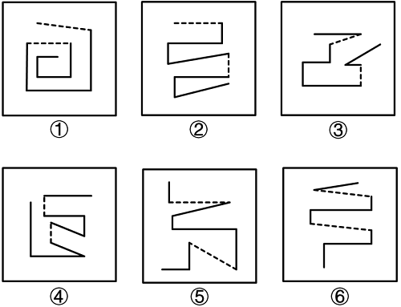
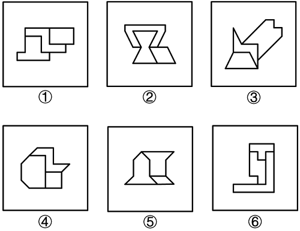
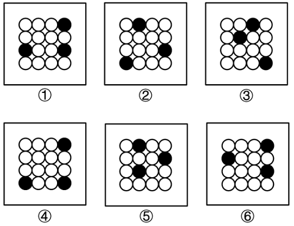

# 判断

## 图推
### 77 
从所给的四个选项中，选择最合适的一个填入问号处，使之呈现一定的规律性：

::: info 解析
元素组成相同，但无明显位置规律，优先考虑数量规律。题干图形中黑球零散分布，考虑部分数，观察发现，题干图形中白球的部分数均为3
:::

### 83
把下面的六个图形分为两类，使每一类图形都有各自的共同特征或规律，分类正确的一项是：

::: info 解析
题干图形均由7条实线和2条虚线构成，元素组成相同，但没有位置规律，考虑数量规律。继续观察发现，图①④⑥中，2条虚线中间夹着3条实线，图②③⑤中，2条虚线中间夹着4条实线。
:::
### 84
把下面的六个图形分为两类，使每一类图形都有各自的共同特征或规律，分类正确的一项是：

::: info 解析
题干图形均由3个面构成，考虑图形间关系，但没有规律。继续观察发现，图①②④中三个面均分别为轴对称图形、中心对称图形、既轴又中心对称图形，图③⑤⑥中三个面均分别为轴对称图形、中心对称图形、轴对称图形。
:::

### 85
把下面的六个图形分为两类，使每一类图形都有各自的共同特征或规律，分类正确的一项是：

::: info 解析
元素组成相同，但无明显位置规律，考虑将3个黑球连线，观察连线的规律。图①③④中黑球的连线均构成直角三角形，图②⑤⑥中黑球的连线均构成锐角三角形
:::
## 逻辑判断

## 定义判断
### 86
生物炼制是以**可再生生物资源**为原料，以**微生物或酶为催化剂**进行物质转化，**大规模生产**人类所需的化学品、医药、能源和材料等。

根据上述定义，下列最有可能属于生物炼制的是：B

A：利用微生物代谢，将石油中的烃类物质转化为各种化学品，如脂肪酸、油脂、蛋白质、B族维生素（不符合可再生资源）

B：通过高温高压处理将玉米秸秆中的纤维素分离出来，再经过发酵处理将纤维素转化为生物塑料材料

C：对木材进行干燥、粉碎等预处理后，将其放入热解炉中在无氧或缺氧条件下加热，会生成生物炭（焚烧）

D：将农林剩余物稻壳筛选和粉碎后与聚丙烯进行混合，通过压制成型工艺制成具有一定韧性的材料（物理压缩）
### 87
阿基米德定律是指**浸入静止流体（气体或液体）中的物体**受到一个**浮力，其大小等于该物体所排开的流体重量**。

根据上述定义，下列**最不可能用**阿基米德定律解释的是：C

A：橡皮泥捏成船形可以浮在静止的水面上，捏成实心球则会沉入水中
B：把人放在几乎盛满水的浴盆中，水位变高了，人也会感觉到自己变轻了
C：船体下安装了水翼的船高速航行时船体被**抬离河水水面**
D：完全浸入静止的水中的物体在不同深度受到的浮力相同

### 88
范围不经济是指在相同的投入下，由一个**单一的企业生产联产品**比**多个不同的企业分**别生产这些联产品中每一个单一产品的产出**水平要低**的生产过程。当同时**生产两种产品的费用低于分别生产每种产品所需成本的总和时**，所存在的状况就被称为范围经济。

根据上述定义，下列最有可能**属于**范围经济的是：A

A：某家经营中餐的餐饮企业拓展了西餐业务，由企业统一采购食材，利用现有餐厅场地及服务人员，无需额外增加过多成本便能同时经营中餐及西餐，使整体营收显著提升

B：某汽车厂商专注生产单一型号的新能源SUV汽车，通过长三角地区产业集群优势实现了年产80万辆的目标，其单位生产成本较同行业平均水平低19%（范围不经济）

C：某电子产品制造商利用智能手机成功树立了品牌形象，随后尝试进入智能家居市场，但由于缺乏相关技术积累和市场经验，企业投入了大量资金用于研发和市场开拓（无关）

D：某著名互联网科技公司看到了全球科技革新与生活方式变革加速交织，便同时布局社交软件、智能硬件、医疗健康、太空探索等多个领域（无关）
### 90
行政机关及其执法人员在**作出行政处罚决定之前**未向当事人告知拟作出的行政处罚内容及事实、理由和依据，或者**拒绝听取当事人的陈述、申辩**，就作出行政处罚决定，则该行政处罚决定不能成立，此类行政处罚也被称为不成立行政行为。

根据上述定义，下列属于不成立行政行为的是：

A：某出版社工作人员对情敌怀恨在心，为了打击报复，直接判定情敌在本出版社正在审核的新作品不符合当前社会价值观，因此不能出版（非行政机关）

B：某社区认为街边摊贩占道经营，既阻碍交通又影响市容，在未告知任何理由的情况下直接没收了摊贩的经营工具，并且不听摊贩的解释（该社区不是行政机关）

C：某县中学没有全面收集证据，仅凭一份不完整且未经核实的举报材料便以“违规补课”为由处罚了该校一位高三语文老师（非行政机关）

D：某市环保局在制作书面处罚决定书之前，电话通知某企业需缴纳罚款，企业提出异议，环保局拒绝提供材料并无视该异议
### 92

指代性副词是指在古汉语中，用在**动词或介词前**面**具有指代作用的副词**。它们通常指代**动作行为的受事者**，类似于**前置宾语**。

根据上述定义，下列引号部分最有可能属于指代性副词的是：

A：汝知悔过伏罪，今一切“相”赦
::: info 解析
意思是你知道悔过服罪，现在一切都赦免你。“相”指代你，是动作赦免的对象，符合“指代动作行为的受事者”，
:::
B：愿“君”多采撷，此物最相思
::: info 解析
意思是希望思念的人儿多多采摘，因为它最能寄托相思之情。“君”是采撷的主语，不是采撷的对象，不符合“指代动作行为的受事者”、“类似于宾语前置”，
:::
C：归来“见”天子，天子坐明堂
::: info 解析
意思是胜利归来朝见天子，天子坐在殿堂论功行赏。“见”是朝见的意思，没有指代含义，不符合“指代动作行为的受事者”、“类似于宾语前置”
:::
D：怀民亦未寝，相与步“于”中庭
::: info 解析
意思是怀民也没有睡，我们便一同在庭院中散步。“于”是在的意思，没有指代含义，不符合“指代动作行为的受事者”
:::

### 93
背景风主要是指在大尺度（空间范围1000公里以上）天气系统或地理环境因素影响下形成的、**相对稳定且**具有**一定方向性的风**。局地风是相对于背景风而言，主要是因**局部地区**下垫面性质差异、地形起伏等因素导致的小范围的空气流动。当空气作绝热下沉运动，因温度升高湿度降低而形成的一种干热风叫作焚风，是**由山地引发**的一种局部范围内的空气运动形式。

根据上述定义，下列**判断错误**的是：

A：在赤道低气压带和副热带高气压带之间的信风带，常年吹的东北信风是局地风（背景风）

B：某城市中心因活动集中，气温较高，空气上升形成从郊区吹向城市的风是局地风

C：当空气从海拔四千至五千米的高山下降至地面时，温度会升高以上，使凉爽的气候顿时热起来，这是焚风

D：因湖泊和周边陆地热力性质差异，在洞庭湖旁感受到的出湖风和进湖风是局地风

## 类比推理

### 104
104.
单选题
某书法兴趣班举办了一场书法学习活动，活动结束后，关于学员们掌握的书法字体的情况，有如下说法：

①或者孙同学没有掌握行书字体，或者赵同学没有掌握瘦金体；

②赵同学没有掌握瘦金体；

③同学们都没掌握草书字体；

④有的同学掌握了草书字体。

如果上述说法两真两假，那么以下说法**除哪项外**，均一定为真？ A

A说法④是真的

B孙同学没有掌握行书字体

C赵同学掌握了瘦金体

D说法①是真的

::: info 解析

3和4矛盾 一真一假

2对，1一定对,所以 1对 2错 赵同学掌握瘦金体  孙同学没有掌握行书

3错，4对

::: 

### 105
纳尔迈调色板是一块出土于埃及的盾形石板，两面雕刻着纪念古埃及蝎子王纳尔迈统治的画面。有学者认为，纳尔迈调色板上的“蝎子+权杖”图案与“禹”字的甲骨文、金文象形高度相似，因此推测大禹就是古埃及的蝎子王。

以下哪项如果为真，可以削弱上述结论？

①我国三星堆出土的一个黄金权杖上面也有类似于“蝎子+权杖”的图案

②“禹”字的甲骨文、金文象形是“大头尖嘴鱼+叉子”，仅与纳尔迈调色板上的图案略微相似

③纳尔迈调色板图案右下角有一个逃跑的人，非常像“蚩尤”战败奔逃的场景

④虽形状相似，但纳尔迈调色板上的“蝎子+权杖”象征古埃及时期的黄金飞机和王权，而“禹”字的甲骨文、金文象形象征治理和战胜洪水，二者的象征义完全不同，而象征义代表统治者身份

::: info 解析
论据：纳尔迈调色板上的“蝎子+权杖”图案与“禹”字的甲骨文、金文象形高度相似
论证：大禹就是古埃及的蝎子王。
① 不明确项
② 削弱论据
③ 不明确项
④ 拆桥项

:::
## 一拖五

